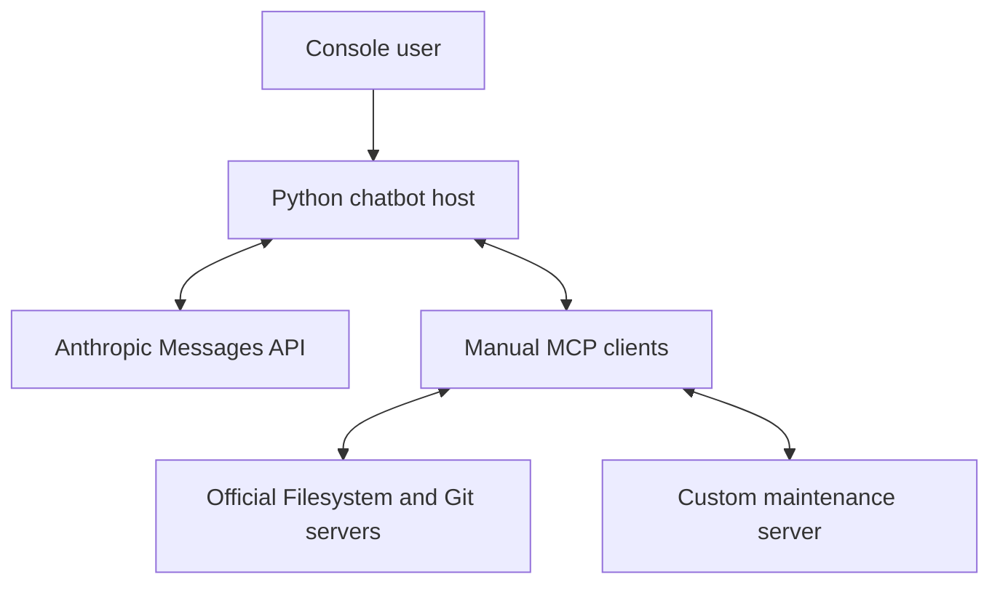

# CC3067 Project 1 - Manual MCP Chatbot

This repository contains the first delivery of Project 1 for **CC3067 Networks**.
It implements a console chatbot that connects an Anthropic language model to local
Model Context Protocol (MCP) servers.

The MCP client and the custom server were built manually with JSON-RPC 2.0. No MCP
SDK, FastMCP, or framework that hides the protocol exchange is used.

## Features

- Direct connection to the Anthropic Messages API using HTTPS.
- Conversation history is preserved during the active session.
- Every MCP request, notification, response, and server diagnostic is stored in a
  JSON Lines log.
- Integration with the official Filesystem reference server.
- Integration with the official Git reference server.
- A custom local MCP server for industrial machinery maintenance.
- Human confirmation before tools that create or modify data.
- Commands to inspect connected servers, registered tools, and recent log entries.

## Architecture



The local MCP transport uses `stdin` and `stdout`. Each message is one UTF-8
JSON-RPC object on a single line. The sequence used by the client is:

1. Send `initialize` with protocol version `2025-11-25`.
2. Receive the server capabilities and negotiated version.
3. Send `notifications/initialized`.
4. Discover tools with `tools/list`.
5. Invoke selected tools with `tools/call`.
6. Close the child process streams during shutdown.

## Requirements

- Python 3.11 or newer
- Git
- Node.js 22 or newer, including `npx`
- `uv`/`uvx` for the official Git MCP server
- An Anthropic API key

The Python application uses only the standard library. `npx` and `uvx` download
the official reference servers the first time they are started.

## Installation on Windows

Open PowerShell inside this project directory.

1. Confirm the required programs:

   ```powershell
   python --version
   git --version
   node --version
   npx --version
   uvx --version
   ```

2. If `uvx` is missing, install `uv` with the official installer or with `pip`:

   ```powershell
   python -m pip install uv
   ```

3. Create the environment file:

   ```powershell
   Copy-Item .env.example .env
   notepad .env
   ```

4. Replace `replace_with_your_key` with the real Anthropic API key. Do not commit
   `.env`; it is already excluded by `.gitignore`.

No additional `pip install` command is required for the application.

## Run the automated tests

```powershell
python -m unittest discover -s tests -v
```

The tests start the custom server as a real child process and verify initialization,
tool discovery, tool invocation, persistence, input validation, and JSONL logging.
They do not call the paid Anthropic API.

Verify the custom and official MCP servers without using an API key:

```powershell
python -m scripts.verify_servers
```

This command checks version negotiation and tool discovery for all three servers.

## Run the chatbot

```powershell
python -m src.chatbot
```

The first startup of the official servers may take longer because `npx` and `uvx`
must download their packages. A successful startup displays three connected servers:
`maintenance`, `filesystem`, and `git`.

Available console commands:

| Command | Purpose |
| --- | --- |
| `/help` | Show the command list |
| `/servers` | Show connected and failed servers |
| `/tools` | Show the namespaced tools sent to the LLM |
| `/logs 20` | Show the last 20 MCP log entries |
| `/clear` | Clear conversation history |
| `/exit` | Close the servers and exit |

## Demonstration scenarios

### 1. LLM connection and session context

Send these messages separately:

```text
Who was Alan Turing?
When was he born?
```

The second response should understand that “he” refers to Alan Turing because the
host sends the full session history in the next Messages API request.

### 2. Custom industrial maintenance server

```text
List the machines that currently have a warning.
Check whether there is a spare sealing resistance for machine SELL-01.
Create a high-priority work order for SELL-01 to inspect the sealing resistance.
```

The first two actions are read-only. The third action displays a confirmation prompt
before it writes the new order to `data/maintenance.json`.

### 3. Official Filesystem and Git servers

```text
In the allowed demo workspace, create a README.md that says this repository was
created to demonstrate the official Filesystem and Git MCP servers. Then check Git
status, add only README.md, and commit it with the message "docs: add demo README".
```

Approve the write, add, and commit operations when the console asks. The demo
repository is automatically created inside `demo_workspace` and has a local Git
identity so it does not depend on the user's global Git settings.

Verify the commit outside the chatbot:

```powershell
git -C .\demo_workspace log --oneline --max-count=3
```

## MCP interaction log

The default log is `logs/mcp_interactions.jsonl`. Each line contains:

- UTC timestamp
- server name
- direction (`client_to_server`, `server_to_client`, or `server_stderr`)
- complete JSON-RPC message or diagnostic text

Example command:

```powershell
Get-Content .\logs\mcp_interactions.jsonl | Select-Object -Last 20
```

API keys are never written to this log. Tool arguments and returned data are logged,
so the log must not be published if a demonstration uses sensitive information.

## Custom server tools

| Tool | Type | Main parameters | Purpose |
| --- | --- | --- | --- |
| `list_machines` | Read | `status` (optional) | List registered machines |
| `get_machine_status` | Read | `machine_id` | Return one machine record |
| `list_work_orders` | Read | `machine_id`, `status` (optional) | Search maintenance orders |
| `check_spare_part` | Read | `query` | Search inventory and indicate reorder need |
| `create_work_order` | Write | `machine_id`, `issue`, `priority` | Store a new order |
| `close_work_order` | Write | `work_order_id`, `resolution` | Close an existing order |

The complete specification, raw JSON-RPC examples, delivery checklist, and suggested
presentation script are in [ENTREGA_1.md](ENTREGA_1.md).

The first-delivery report requested by the instructor is available in
[`docs/Reporte_Entrega_1.pdf`](docs/Reporte_Entrega_1.pdf). It contains only item 8
(local server specification) and item 10 (conclusions and project comment). Wireshark
analysis is intentionally reserved for the second delivery.

## Project structure

```text
config/servers.json              Local MCP process configuration
data/maintenance.json            Demonstration data
demo_workspace/                  Restricted Filesystem/Git demonstration area
logs/                            Generated JSONL interaction logs
src/anthropic_client.py          Direct Messages API client
src/chatbot.py                   Console host and tool-use loop
src/config.py                    Cross-platform configuration
src/maintenance_server.py        Manual custom MCP server
src/mcp_client.py                Manual stdio MCP client
src/mcp_logging.py               Interaction logger
tests/                            Automated tests
scripts/verify_servers.py         Server-only integration check
```

## Version-control recommendations

Use a private GitHub repository and grant access to the instructors and teaching
assistants. Make commits as development progresses instead of uploading everything
in a final commit. Suggested future commit topics are:

- `feat: add manual JSON-RPC client lifecycle`
- `feat: add industrial maintenance MCP server`
- `feat: integrate official filesystem and git servers`
- `test: cover stdio transport and maintenance tools`
- `docs: add setup and delivery one demonstration`

Do not alter commit dates or create fake development history. Continue making small,
real commits whenever a feature, fix, test, or documentation section is completed.

## Current scope and limitations

- This delivery implements local stdio transport only. The remote Streamable HTTP
  server and Wireshark analysis belong to the second part of the project.
- The custom server is a teaching prototype with a JSON file, not a production CMMS.
- The industrial use case must be approved by the instructor before it is treated as
  the final selected case.
- The official reference servers should be limited to the included demo workspace.
- The Anthropic API integration must be tested with the student's own key because
  credentials are never included in this repository.

## References

- [MCP lifecycle, version 2025-11-25](https://modelcontextprotocol.io/specification/2025-11-25/basic/lifecycle)
- [MCP stdio transport](https://modelcontextprotocol.io/specification/2025-11-25/basic/transports)
- [MCP tools specification](https://modelcontextprotocol.io/specification/2025-11-25/server/tools)
- [Official MCP reference servers](https://github.com/modelcontextprotocol/servers)
- [JSON-RPC 2.0 specification](https://www.jsonrpc.org/specification)
- [Anthropic Messages API](https://docs.anthropic.com/en/api/messages)
- [Anthropic client tool-use flow](https://docs.anthropic.com/en/docs/agents-and-tools/tool-use/handle-tool-calls)
